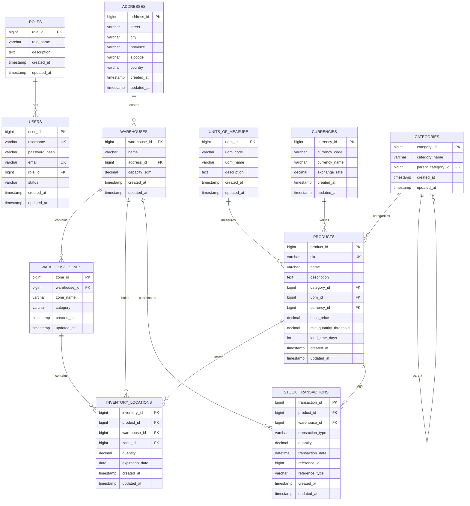

# 📊 AmbatuGrow ERP - Entity Relationship Diagram & Database Schema

This document details the Entity Relationship Diagram (ERD) and relational database schema structure of the **AmbatuGrow ERP Inventory System**, built on MySQL.

---

## 📐 Entity Relationship Diagram (ERD)

The following Mermaid diagram maps out the relationships between tables in the system. 

---

## 🗄️ Detailed Database Schema

### 1. `roles`
Stores access control roles defining terminal authorization.
* **`role_id`** (`BIGINT`, PK, Auto-Increment): Unique identifier for the role.
* **`role_name`** (`VARCHAR(255)`): Unique name of the role (e.g., `System Administrator`, `Inventory Officer`).
* **`description`** (`TEXT`, Nullable): Description of privileges.
* **`created_at` / `updated_at`** (`TIMESTAMP`): Record tracking timestamps.

---

### 2. `addresses`
Physical logistics locations for warehouses.
* **`address_id`** (`BIGINT`, PK, Auto-Increment): Unique identifier.
* **`street`** (`VARCHAR(255)`): Street address.
* **`city`** (`VARCHAR(255)`): City.
* **`province`** (`VARCHAR(255)`): State or Province.
* **`zipcode`** (`VARCHAR(50)`): Postal code.
* **`country`** (`VARCHAR(255)`): Country (e.g., `Philippines`).
* **`created_at` / `updated_at`** (`TIMESTAMP`): Record tracking timestamps.

---

### 3. `units_of_measure`
Catalog units defining stock dimensions.
* **`uom_id`** (`BIGINT`, PK, Auto-Increment): Unique identifier.
* **`uom_code`** (`VARCHAR(50)`): Short acronym (e.g., `pcs`, `kg`, `L`, `bag`).
* **`uom_name`** (`VARCHAR(255)`): Full display label (e.g., `Pieces`, `Kilogram`).
* **`description`** (`TEXT`, Nullable): Detailed specification.
* **`created_at` / `updated_at`** (`TIMESTAMP`): Record tracking timestamps.

---

### 4. `currencies`
Exchange valuation rates used for multi-currency conversion.
* **`currency_id`** (`BIGINT`, PK, Auto-Increment): Unique identifier.
* **`currency_code`** (`VARCHAR(10)`): ISO symbol (e.g., `PHP`, `USD`).
* **`currency_name`** (`VARCHAR(255)`): Formal title (e.g., `Philippine Peso`).
* **`exchange_rate`** (`DECIMAL(8,4)`): Conversion factor relative to native base unit.
* **`created_at` / `updated_at`** (`TIMESTAMP`): Record tracking timestamps.

---

### 5. `users`
Authenticated operators managing inventory terminals.
* **`user_id`** (`BIGINT`, PK, Auto-Increment): Unique identifier.
* **`username`** (`VARCHAR(255)`, Unique): Login username handles.
* **`password_hash`** (`VARCHAR(255)`): BCRYPT hashed password keys.
* **`email`** (`VARCHAR(255)`, Unique): Operator notification address.
* **`role_id`** (`BIGINT`, FK -> `roles.role_id`): Associated authorization role.
* **`status`** (`VARCHAR(50)`, Default: `'Active'`): User status status tracking.
* **`created_at` / `updated_at`** (`TIMESTAMP`): Record tracking timestamps.

---

### 6. `categories`
Hierarchical product organization divisions.
* **`category_id`** (`BIGINT`, PK, Auto-Increment): Unique identifier.
* **`category_name`** (`VARCHAR(255)`): Classification display name.
* **`parent_category_id`** (`BIGINT`, FK -> `categories.category_id`, Nullable): Hierarchical parent code.
* **`created_at` / `updated_at`** (`TIMESTAMP`): Record tracking timestamps.

---

### 7. `products`
The main item catalog tracking unit details.
* **`product_id`** (`BIGINT`, PK, Auto-Increment): Unique identifier.
* **`sku`** (`VARCHAR(50)`, Unique): Stock Keeping Unit string.
* **`name`** (`VARCHAR(255)`): Product label.
* **`description`** (`TEXT`, Nullable): Product properties.
* **`category_id`** (`BIGINT`, FK -> `categories.category_id`): Catalog section.
* **`uom_id`** (`BIGINT`, FK -> `units_of_measure.uom_id`): Item measurements unit.
* **`currency_id`** (`BIGINT`, FK -> `currencies.currency_id`): Reference currency.
* **`base_price`** (`DECIMAL(10,2)`): Base acquisition value.
* **`min_quantity_threshold`** (`DECIMAL(10,2)`): Lower alert trigger limit.
* **`lead_time_days`** (`INTEGER`): Manufacturing or shipping delivery delays in days.
* **`created_at` / `updated_at`** (`TIMESTAMP`): Record tracking timestamps.

---

### 8. `warehouses`
Physical storage facilities.
* **`warehouse_id`** (`BIGINT`, PK, Auto-Increment): Unique identifier.
* **`name`** (`VARCHAR(255)`): Warehouse location tag.
* **`address_id`** (`BIGINT`, FK -> `addresses.address_id`): Logistics address keys.
* **`capacity_sqm`** (`DECIMAL(10,2)`): Floor limits capacity size.
* **`created_at` / `updated_at`** (`TIMESTAMP`): Record tracking timestamps.

---

### 9. `warehouse_zones`
Specific internal sectors within a warehouse (e.g. Zone A, Zone B).
* **`zone_id`** (`BIGINT`, PK, Auto-Increment): Unique identifier.
* **`warehouse_id`** (`BIGINT`, FK -> `warehouses.warehouse_id`): Parent facility.
* **`zone_name`** (`VARCHAR(255)`): Internal segment display label.
* **`category`** (`VARCHAR(255)`): Storage environment property (e.g., `Dry Storage`, `Cold Storage`).
* **`created_at` / `updated_at`** (`TIMESTAMP`): Record tracking timestamps.

---

### 10. `inventory_locations`
The core balance tables recording physical quantities of active products within zones.
* **`inventory_id`** (`BIGINT`, PK, Auto-Increment): Unique identifier.
* **`product_id`** (`BIGINT`, FK -> `products.product_id`): Tracked item.
* **`warehouse_id`** (`BIGINT`, FK -> `warehouses.warehouse_id`): Holding facility.
* **`zone_id`** (`BIGINT`, FK -> `warehouse_zones.zone_id`): Specific internal sector.
* **`quantity`** (`DECIMAL(10,2)`): Live stock levels.
* **`expiration_date`** (`DATE`, Nullable): Date threshold for perishable items (enforcing FEFO).
* **`created_at` / `updated_at`** (`TIMESTAMP`): Record tracking timestamps.

---

### 11. `stock_transactions`
The ledger capturing movements (Stock-in, Stock-out, and transfers).
* **`transaction_id`** (`BIGINT`, PK, Auto-Increment): Unique identifier.
* **`product_id`** (`BIGINT`, FK -> `products.product_id`): Target item.
* **`warehouse_id`** (`BIGINT`, FK -> `warehouses.warehouse_id`): Facility source.
* **`transaction_type`** (`ENUM('Stock-in', 'Stock-out', 'Transfer')`): Direction.
* **`quantity`** (`DECIMAL(10,2)`): Moving unit count.
* **`transaction_date`** (`DATETIME`): Date of execution.
* **`reference_id` / `reference_type`** (`VARCHAR/BIGINT`, Nullable): Morphic association columns matching corresponding business logs.
* **`created_at` / `updated_at`** (`TIMESTAMP`): Record tracking timestamps.
